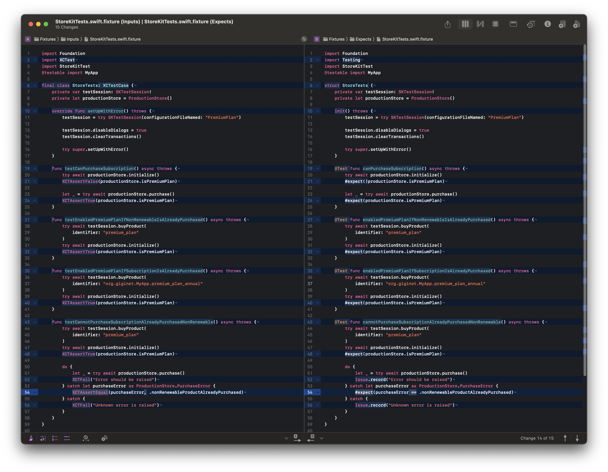
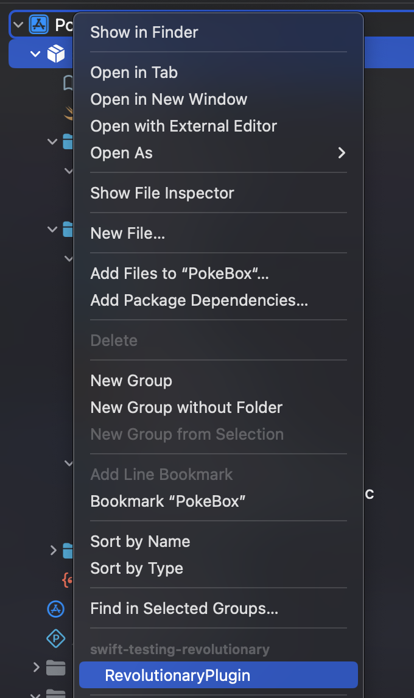
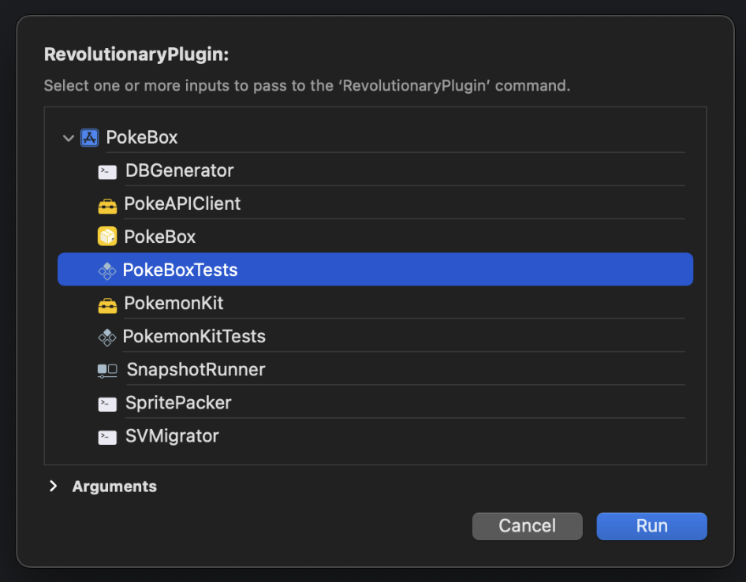
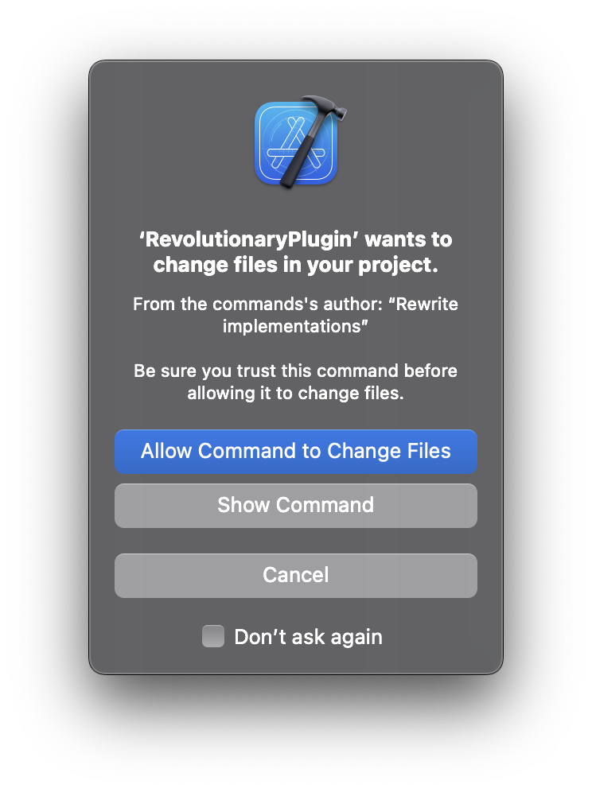

# swift-testing-revolutionary


[](https://developer.apple.com/xcode/)
[](https://swift.org/package-manager/) 

[
](https://github.com/giginet/Scipio/blob/main/LICENSE.md)

swift-testing-revolutionary converts test cases written in XCTest to [swift-testing](https://github.com/apple/swift-testing)




## Usage

This tool provides three ways to use. As an Xcode Plugin, as a Command Plugin, or as a command line tool.

**In default, all test files will be overwritten unless you passed `--dry-run` flag. Please make sure to backup your test files before running this tool.**

### Xcode Plugin

For Xcode project, it's better to use as a Xcode plugin.

### 1. Add package to your Xcode project

- File > Swift Packages > Add Package Dependency
- Add https://github.com/giginet/swift-testing-revolutionary.git Select "Up to Next Major" with "0.1.0"

### 2. Right click on your project root and select `RevolutionaryPlugin`.



### 3. Choose the test target you want to convert.



### 4. Allow change access if needed.



### Package Command Plugin

For Swift packages, it's better to use as a package plugin.

#### 1. Add package plugin to your package

```swift
let package = Package(
    name: "MyPackage",
    dependencies: [
        .package(url: "https://github.com/giginet/swift-testing-revolutionary", from: "0.1.0"),
    ]
)
```

#### 2. Run the plugin on your package

You can pass the directories or files you want to convert.

```console
$ swift package plugin --allow-writing-to-package-directory swift-testing-revolutionary Tests/ MyTests1.swift MyTests2.swift
```

### Command Line Tool

Install this tool and run it from the command line.

```console
$ swift-testing-revolutionary path/to/Tests
```

#### Using Mint

```console
$ mint install giginet/swift-testing-revolutionary 
```

#### Using `experimental-install`

```console
$ git clone https://github.com/giginet/swift-testing-revolutionary
$ cd swift-testing-revolutionary
$ swift package experimental-install
```

#### Using Artifact Bundle

Download `swift-testing-revolutionary.artifactbundle.zip` from [Releases](https://github.com/giginet/swift-testing-revolutionary/releases) and unzip it.

## Options

You can pass some options to the command.  

| Option                             | Description                                                  | Default |
|------------------------------------|--------------------------------------------------------------|---------|
| --dry-run                          | Run as a dry run mode. All test files are not overwritten    |         |
| --enable/disable-struct-conversion | Whether converting test classes to structs or not            | Enabled |
| --enable/disable-strip-test-prefix | Whether stripping `test` prefix from each test method or not | Enabled |

### Struct Conversion

In the default, all test classes would be converted to structs.

```swift
// Before
class MyModelTests: XCTestCase { }

// After
struct MyModelTests { } // Enabled (Default)
class MyModelTests { } // Disabled
```

#### Note

If the test case contains `tearDown` method. This tool always converts them to de-initializers.
However, `deinit` can't be defined in the struct so this option should be passed for such cases.

### Strip Test Prefix

In the default, all test methods would be stripped `test` prefix.

```swift
// Before
func testProperty() { }

// After
@Test property() { } // Enabled (Default)
@Test testProperty() { } // Disabled
```

## How to migrate tests for swift-testing

See this article in [swift-testing](https://github.com/apple/swift-testing) documentation.

[Migrating a test from XCTest | Documentation](https://swiftpackageindex.com/apple/swift-testing/main/documentation/testing/migratingfromxctest)

## Supporting Conversions

Currently, this tool supports following conversions referred above documentation.

- [x] Import statements of XCTest (`import XCTest`)
- [x] Test classes to structs (`final class XXXTests: XCTestCase`)
- [x] Setup and teardown functions (`setUp`, `tearDown`)
- [x] Test methods `func testXXX()`
- [x] Assertion functions (`XCTAssert~`)
- [x] Check for optional values (`XCTUnwrap`)
- [x] Record Issues (`XCTFail`)
- [ ] Continue or halt after test failures (`continueAfterFailure`)
- [ ] Validate asynchronous behaviors (`XCTExpectation`)
- [ ] Control whether a test runs (`XCTSkipIf`, `XCTSkipUnless`)
- [ ] Annotate known issues (`XCTExpectFailure`)

Unsupported features have to be converted manually.

## License

MIT License
